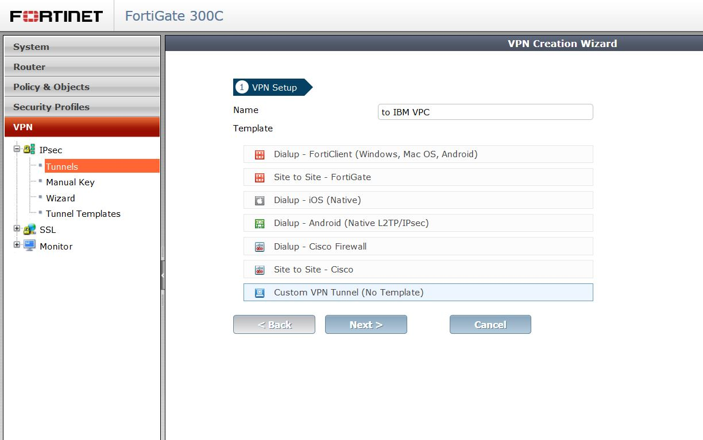
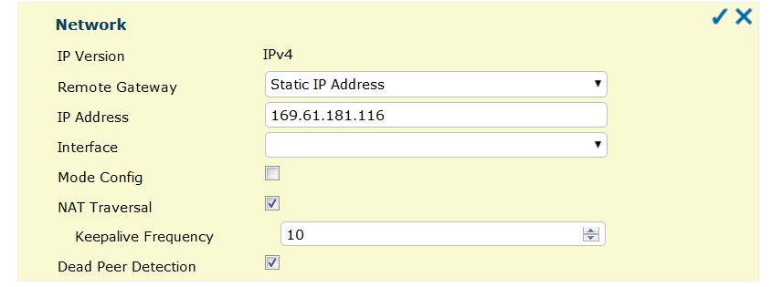
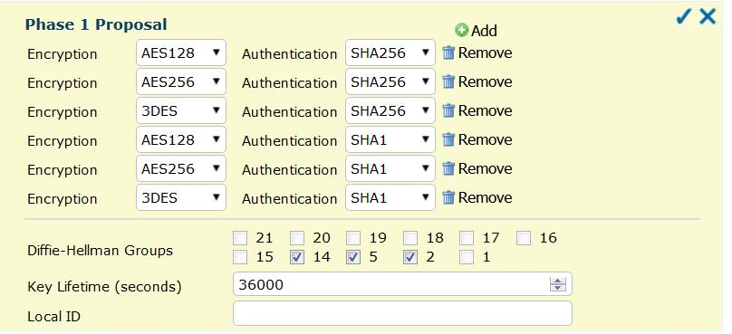
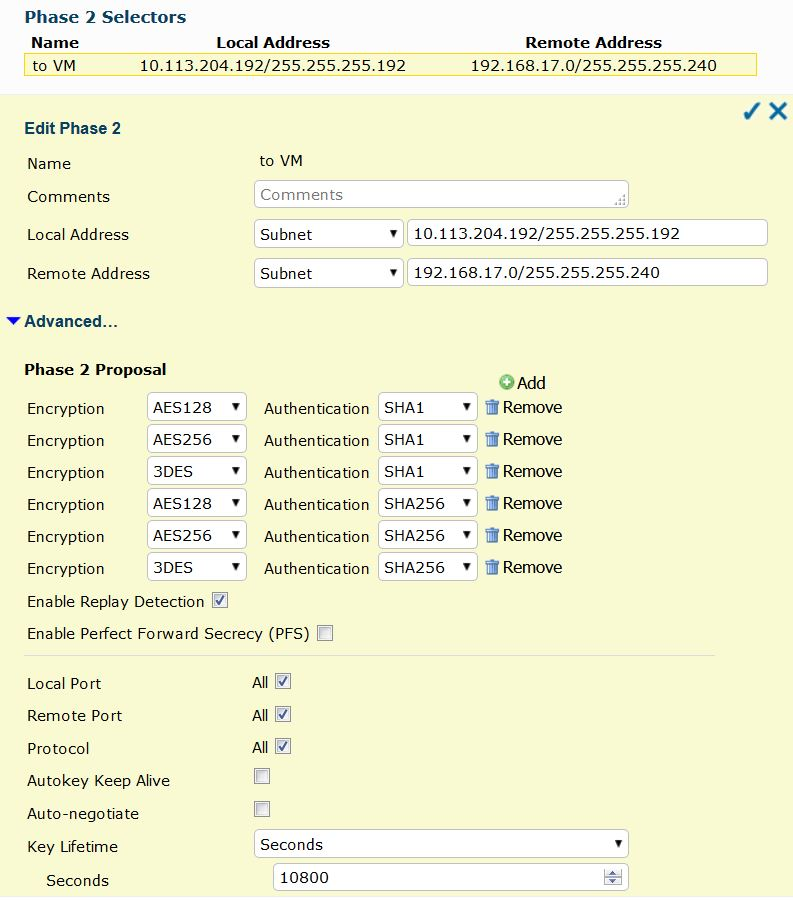

---

copyright:
  years: 2017, 2018, 2019
lastupdated: "2019-01-23"

---

{:shortdesc: .shortdesc}
{:codeblock: .codeblock}
{:screen: .screen}
{:new_window: target="_blank"}
{:pre: .pre}
{:tip: .tip}
{:table: .aria-labeledby="caption"}
{:download: .download}

# Creating a secure connection with a remote FortiGate peer

This document is based on FortiGate 300C, Firmware Version	v5.2.13, build762 (GA).

The example steps that follow skip the prerequisite steps of using {{site.data.keyword.cloud}} API or CLI to create Virtual Private Clouds. For more information, see [Getting Started](https://{DomainName}/docs/infrastructure/vpc?topic=vpc-getting-started-with-ibm-cloud-virtual-private-cloud-infrastructure) and [VPC setup with APIs](https://{DomainName}/docs/infrastructure/vpc?topic=vpc-creating-a-vpc-using-the-rest-apis).

## Example steps
The topology for connecting to the remote FortiGate peer is similar to creating a VPN connection between two VPCs. However, one side is replaced by the FortiGate 300C unit.

### To create a secure connection with the remote Fortigate peer

Go to **VPN \> IPsec \> Tunnels** and create a new custom tunnel or edit an existing tunnel.

When a FortiGate unit receives a connection request from a remote VPN peer, it uses IPsec Phase 1 parameters to establish a secure connection and authenticate that VPN peer. Then, if the security policy permits the connection, the FortiGate unit establishes the tunnel using IPsec Phase parameters and applies the IPsec security policy. Key management, authentication, and security services are negotiated dynamically through the IKE protocol.

**To support these functions, the following general configuration steps must be performed by the FortiGate unit:**

* Define the Phase 1 parameters that the FortiGate unit requires to authenticate the remote peer and establish a secure connection.

* Define the Phase 2 parameters that the FortiGate unit requires to create a VPN tunnel with the remote peer.

* Create security policies to control the permitted services and permitted direction of traffic between the IP source and destination addresses.

By default, some typical Phase 1 and Phase 2 parameters have been set.

### Configuring for the IBM Cloud VPC VPN

To connect to the IBM Cloud VPC's VPN capability, we recommend the following configuration:

1. Choose IKEv2 in authentication;
2. Enable `DH-group 2` in the Phase 1 proposal
3. Set `lifetime = 36000` in the Phase 1 proposal
4. Disable PFS in the Phase 2 proposal
5. Set `lifetime = 10800` in the Phase 2 proposal
6. Input your subnet's information in Phase 2
7. The remaining parameters keep their default values.

### Network parameters

### Authentication parameters

### Phase 1 parameters

### Phase 2 parameters

## To create a secure connection with the local IBM VPC

To create a secure connection, you'll create the VPN connection within your VPC, which is similar to the 2 VPC example.

* Create a VPN gateway on your VPC subnet  along with a VPN connection between the VPC and the FortiGate unit, setting `local_cidrs` to the subnet value on the VPC, and `peer_cidrs` to the subnet value on the FortiGate.

**Note:** The gateway status appears as `pending` while the VPN gateway is being created, and the status becomes `available` once creation is complete. Creation may take some time.

### Check the status of the secure connection

You can check the status of your connection through the IBM Cloud console. Also, you could try to do a `ping` from site to site using the VSIs.

