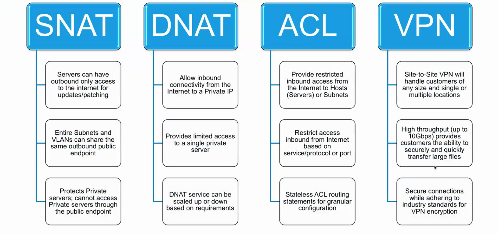

---

copyright:
  years: 2017, 2018, 2019
lastupdated: "2019-01-16"

---

{:shortdesc: .shortdesc}
{:new_window: target="_blank"}
{:codeblock: .codeblock}
{:pre: .pre}
{:screen: .screen}
{:tip: .tip}
{:download: .download}

# About Networking for VPC

A Virtual Private Cloud (VPC) is a virtual network that's tied to your customer account. It gives you cloud security, with the ability to scale dynamically, by providing fine-grained control over your virtual infrastructure and your network traffic segmentation.

In this document, you'll find concepts that describe use cases and capabilities within {{site.data.keyword.cloud}} VPC for subnets, Floating IP addresses, and VPN connections.

**Figure: A customer can subdivide a Virtual Private Cloud with subnets, and each subnet can reach the public internet, if desired.**

As shown in the figure:

* Subnets can connect to the public internet through an optional Public Gateway (PGW).
* You can assign a Floating IP address (FIP) to any VSI to reach it from the internet, or vice versa.
* Subnets in the IBM Cloud VPC offer private connectivity; they can talk to each other over a private link. Setting up routes is not necessary.

## Terminology

This [glossary](../vpc/vpc-glossary.html) contains definitions and information about terms used in this document for IBM Cloud VPC.

## Characteristics of subnets in the VPC

A subnet consists of a specified IP address range (CIDR block). Subnets are bound to a single zone, and they cannot span multiple zones or regions. However, a subnet can span the entirety of the zone abstractions within their Virtual Private Cloud. Subnets in the same IBM Cloud VPC are connected to each other.

### Zones

A zone is an abstraction designed to assist with improved fault tolerance and decreased latency. A zone guarantees the following properties:

 * Each zone is an independent fault domain and it is extremely unlikely for two zones in a region to fail simultaneously
 * Traffic between zones in a region will have less than 2ms of latency

### Reserved IP Addresses

Certain IP addresses are reserved for use by IBM when operating the Virtual Private Cloud. Here are the reserved addresses (these IP addresses assume that the subnet's CIDR range is 10.10.10.0/24):

  * First address in the CIDR range (10.10.10.0): Network address
  * Second address in the CIDR range (10.10.10.1): Gateway address
  * Third address in the CIDR range (10.10.10.2): reserved by IBM
  * Fourth address in the CIDR range (10.10.10.3): reserved by IBM for future use
  * Last address in the CIDR range (10.10.10.255): Network broadcast address

### Use a Public Gateway for external connectivity of a subnet

A **Public Gateway (PGW)** enables a subnet (with all the VSIs attached to the subnet) to connect to the internet. Note that subnets are private by default; however, optionally, you can create a PGW and attach a subnet to the PGW. After a subnet is attached to the PGW, all the VSIs in that subnet can connect to the internet.

PGW uses _Many-to-1 NAT_, which means that thousands of VSIs with private addresses will use 1 public IP address to talk to the public internet. PGW does not enable the internet to initiate a connection with those instances. Use the API to attach and detach subnets to and from your PGW.

The following figure summarizes the current scope of gateway services.

**Note:**  A public gateway is created in a VPC, but the gateway does nothing until it is attached to a subnet. You can create only one public gateway per zone, which means for example that you could have 3 public gateways per VPC in an environment with 3 zones.

### Use a Floating IP address for external connectivity of a VSI 
**Floating IP addresses** are IP addresses that are provided by the system and are reachable from the public internet.

You can reserve a Floating IP address from the pool of available Floating IP addresses provided by IBM, and you can associate or disassociate it with any instance in the same Virtual Private Cloud, by means of the vNIC for that instance. Any Floating IP address can be associated to various types of virtual server instances (VSIs), for example, a load balancer or a VPN gateway.

Your Floating IP address cannot be associated with multiple interfaces. You must specify the interface on the VSI that will be associated with that individual Floating IP. That interface also will have a private IP address. The backend system performs _1-to-1 NAT_ operations between the Floating IP and the Private IP of that interface. A Floating IP is released only when you specifically request the release action. 

**Notes:**
* **Associating a Floating IP address with a VSI removes the VSI from the PGW's Many-to-1 NAT mentioned previously.**
* **Currently, Floating IP supports only IPv4 addresses.**
* **You cannot bring your own public IP address to use as a floating IP.**

For more information about NAT operations, please refer to [the related Internet RFC document ](http://www.faqs.org/rfcs/rfc1631.html){: new_window}.

### Use VPN for secure external connectivity
Virtual Private Network (VPN) service is available for users to connect to their IBM Cloud VPC from the internet, securely.

**VPN Capabilities**
  * Ability to CRUD (Create, Read, Update and Delete) VPN service (site-to-site IPSEC VPN) for handling data transfer.
  * Ability to associate VPN service to a customer's IBM Cloud VPC or virtual network.
  * Ability to identify customer's on-site subnets either by static definition or by dynamic routing.
  * Support for secure ciphers such as SHA256, AES, 3DES, IKEv2
  * Built-in service reliability.
  * Continuous monitoring of VPN connection health.
  * Support for both initiator and responder modes; that is, traffic may be initiated from either side of the tunnel.

## Known Limitations

For a list of known limitations and features not currently supported, please refer to the [Known Limitations](../vpc/known-limitations.html) document.

## Learn More

   * [IBM VPC security](vpc-security.html)
   * [IBM VPC addresses, regions, and subnets](vpc-regions-and-subnets.html)
